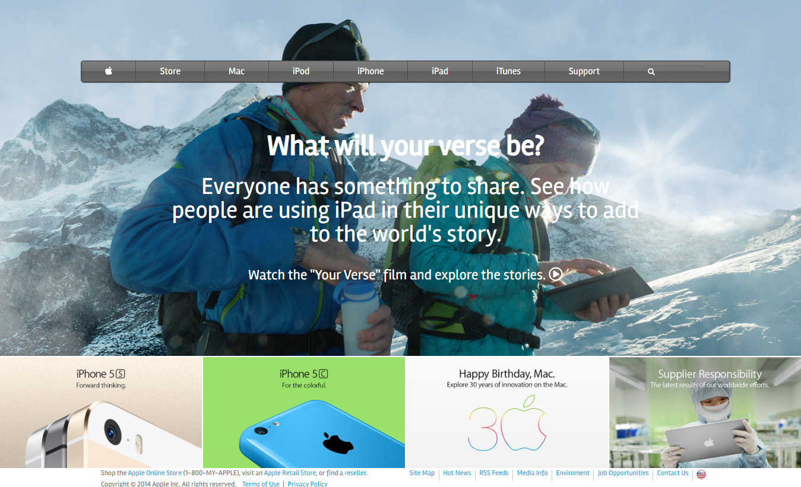

# Apple Clone

> We made a clone of the Apple website to practice CSS backgrounds.

## Built With

- HTML 5 and CSS 3.
- Font awesome.

## Live Demo

[Live Demo Link](https://expjazz.github.io/old-apple-clone/)

### Prerequisites

Having a web browser, code editor and git.

### Install

Just fork it and you are good to go.

## Author

👤 **Expedito Andrade**

- Github: [@githubexpjazz](https://github.com/expjazz)
- Twitter: [@expjazz](https://twitter.com/expeditoandrade13)
- Linkedin: [Expedito Andrade](https://www.linkedin.com/in/expedito-andrade-3645151a4/)
- Email: (expeditojazz@gmail.com)

## 🤝 Contributing

Contributions, issues and feature requests are welcome!

Feel free to check the [issues page](issues/).

## Show your support

Give a ⭐️ if you like this project!

## Acknowledgments

- Content inspired by the original Apple page.

## 📝 License

This project is [MIT](./LICENSE) licensed.
